# 🔄 Diagrama de Secuencia - Anti-Fraud Service

## Flujo completo de análisis de transacciones


## Casos de uso específicos

### 1. Transacción Aprobada (Flujo normal)

```mermaid
sequenceDiagram
    participant Client as Cliente
    participant TS as Transaction Service  
    participant AF as Anti-Fraud Service
    participant DB as Database
    
    Client->>+TS: Crear Transacción ($1,500)
    TS->>+AF: Analyze Transaction
    AF->>+DB: Get Daily Total ($15,000)
    DB->>-AF: Current Total
    AF->>AF: ✅ Individual: $1,500 < $2,500 ✓
    AF->>AF: ✅ Daily: $15,000 + $1,500 = $16,500 < $20,500 ✓
    AF->>+DB: Update Daily Total to $16,500
    DB->>-AF: Updated
    AF->>-TS: APPROVED
    TS->>-Client: Transaction Successful
```



### 2. Transacción Rechazada por Límite Individual

```mermaid
sequenceDiagram
    participant Client as Cliente
    participant TS as Transaction Service
    participant AF as Anti-Fraud Service
    
    Client->>+TS: Crear Transacción ($3,000)
    TS->>+AF: Analyze Transaction  
    AF->>AF: ❌ Individual: $3,000 > $2,500 ✗
    AF->>-TS: REJECTED ("Individual amount exceeds $2,500 limit")
    TS->>-Client: Transaction Denied
```



### 3. Transacción Rechazada por Límite Diario

```mermaid
sequenceDiagram
    participant Client as Cliente
    participant TS as Transaction Service
    participant AF as Anti-Fraud Service
    participant DB as Database
    
    Client->>+TS: Crear Transacción ($2,000)
    TS->>+AF: Analyze Transaction
    AF->>+DB: Get Daily Total ($19,000)
    DB->>-AF: Current Total
    AF->>AF: ✅ Individual: $2,000 < $2,500 ✓
    AF->>AF: ❌ Daily: $19,000 + $2,000 = $21,000 > $20,500 ✗
    AF->>-TS: REJECTED ("Daily limit would be exceeded")
    TS->>-Client: Transaction Denied
```



## Flujo de datos detallado

### Evento de entrada (transaction-events)
```json
{
  "TransactionExternalId": "550e8400-e29b-41d4-a716-446655440001",
  "SourceAccountId": "11111111-1111-1111-1111-111111111111", 
  "TargetAccountId": "22222222-2222-2222-2222-222222222222",
  "TransferTypeId": 1,
  "Value": 1500.00,
  "Status": "Pending",
  "Id": "550e8400-e29b-41d4-a716-446655440002",
  "OccurredAt": "2025-10-24T14:30:00Z",
  "EventType": "transaction.created"
}
```

### Análisis de reglas
```
1. Límite Individual: Value ≤ $2,500
2. Límite Diario: Daily_Total + Value ≤ $20,500
```

### Evento de salida (transaction-status-events)
```json
{
  "TransactionExternalId": "550e8400-e29b-41d4-a716-446655440001",
  "Status": "Approved", // o "Rejected"
  "Reason": "Transaction approved", 
  "ProcessedAt": "2025-10-24T14:30:01Z"
}
```

## Componentes del sistema

| Componente | Responsabilidad |
|------------|-----------------|
| **KafkaConsumerService** | Consumir eventos de transacciones desde Kafka |
| **FraudAnalysisService** | Aplicar reglas de detección de fraude |
| **TransactionDayRepository** | Gestionar totales diarios en PostgreSQL |
| **KafkaService** | Publicar eventos de estado de transacciones |
| **ResponseBuilder** | Formatear respuestas de API consistentemente |

## Manejo de errores


## Configuración de Kafka

### Consumer Configuration
```json
{
  "BootstrapServers": "localhost:9092",
  "GroupId": "fraud-service-group", 
  "AutoOffsetReset": "Earliest",
  "EnableAutoCommit": false
}
```

### Producer Configuration  
```json
{
  "BootstrapServers": "localhost:9092",
  "Acks": "All",
  "Retries": 3,
  "EnableIdempotence": true
}
```

---

**Notas importantes:**
- El servicio procesa eventos de manera asíncrona y en tiempo real
- Los totales diarios se actualizan solo para transacciones aprobadas
- El sistema mantiene logs detallados para auditoría y debugging
- La configuración de Kafka permite alta disponibilidad y exactamente-una-vez delivery